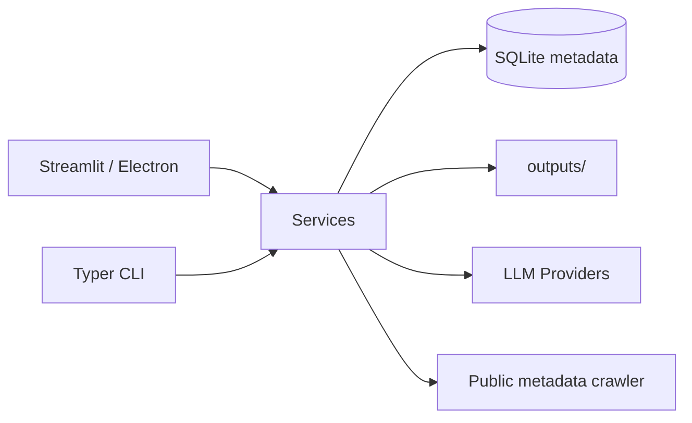

# Architecture

## Layers

| Layer | Path | Responsibility |
| --- | --- | --- |
| UI | `src/fanqie_novel_lab/app.py` | 多页面工作台、弹窗、表格和导出 |
| CLI | `src/fanqie_novel_lab/cli.py` | 命令行工作流 |
| Schemas | `schemas.py` | Pydantic 数据模型 |
| Storage | `db.py`, `data/db/` | SQLite 元数据 |
| Models | `llm.py`, `model_profiles.py` | 模型调用和配置切换 |
| Crawler | `crawler/` | 公开元数据采集 |
| Services | `services/` | 趋势、大纲、章节、审核、发布 |

## Key Services

- `outline_generator.py`：生成和润色大纲。
- `chapter_generator.py`：章节计划、分场景生成、润色和保存。
- `chapter_reviewer.py`：章节对纲审核。
- `collision_reviewer.py`：大纲和公开元数据避撞审查。
- `publisher.py`：作品档案、上传包、发布队列。

## Data Flow

1. 采集或导入公开元数据到 SQLite。
2. 题材 brief + 趋势报告生成大纲。
3. 人工审核后润色大纲。
4. 根据大纲分章节生成正文。
5. 章节对纲审核。
6. 生成发布包并本地跟踪状态。

## Local Files

- `data/config/model_profiles.json`：本地模型配置，不提交。
- `data/db/fanqie_novel_lab.sqlite3`：本地数据库，不提交。
- `outputs/`：大纲、章节、审核报告和发布包，不提交。
