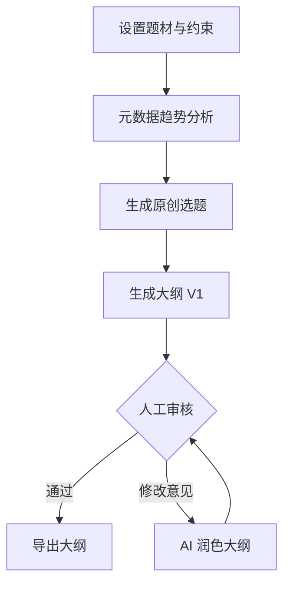

# 工作流说明

## 1. 采集边界

允许采集的公开元数据：

- 榜单名、分类、排名
- 书名、作者名（如公开展示）
- 简介、标签、字数、热度、评分
- 更新时间、连载状态
- 评论关键词的聚合趋势（不保存敏感个人信息）

不建议/不支持：

- 抓取正文、VIP 章节、登录后内容
- 绕过验证码、签名、风控、付费墙
- 批量复制章节再改写
- 模仿某一本书或某个作者的独特表达

## 2. 人审流

## 3. 质量门禁

- 原创性：不能像具体作品
- 钩子强度：前三章必须有清晰爆点
- 金手指规则：强但有限制
- 冲突密度：每章有目标、阻碍、反转或钩子
- 可连载性：卷纲能支撑 80-150 万字
- 平台适配：题材、节奏、爽点适配目标平台
